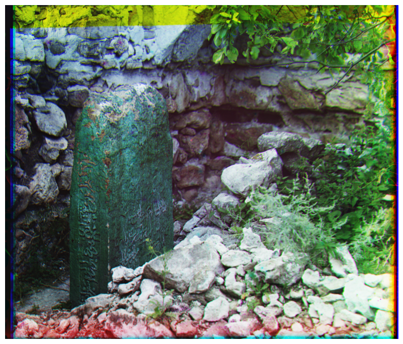

# Image Channel Alignment and Visualization

This repository contains Python code to align and combine the red, green, and blue channels of an image that were captured separately. The goal is to automatically align the channels and produce a final color image without manual intervention.

## Project Overview

The project involves three main steps:
1. **Score Function**: A function to evaluate how well two image channels are aligned.
2. **Channel Alignment**: A function to determine the optimal shift (dx, dy) to align two image channels.
3. **Image Combination**: A function to combine the aligned channels into a final color image.

The code uses NumPy for image manipulation and Matplotlib for visualization.

## Final Output

Below is the final image produced by aligning and combining the red, green, and blue channels:

